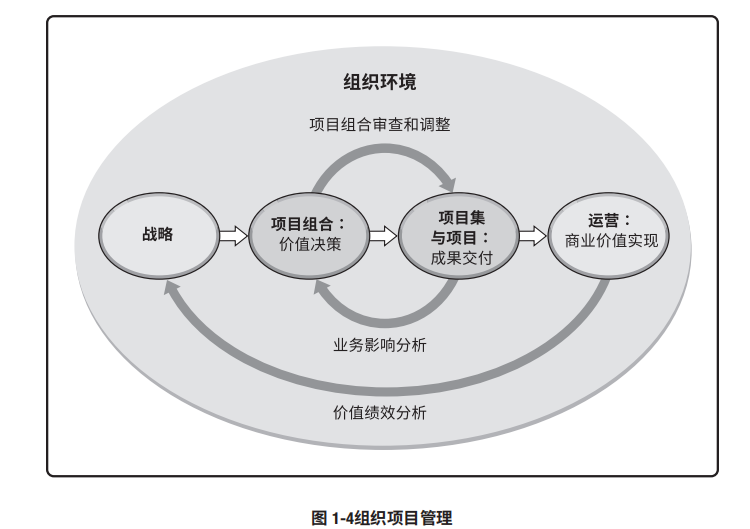
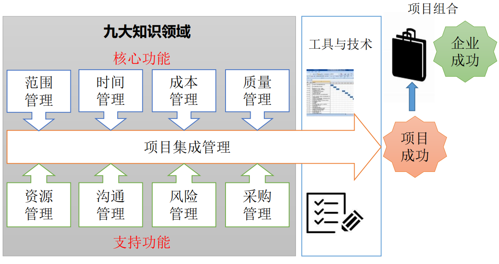

# IT项目管理作业
## 作业1
* 描述projects、programs、 portfolio 、 operations 和 OPM 的概念；
> projects(项目)：项目是为创造独特的产品、服务或成果而进行的临时性工作 

> program(项目集): 项目集是一组相互关联且被协调管理的项目、子项目集和项目集活动，以便获得分别管理所无法获得的利益 

> portfolio(项目组合管理):为实现战略目标而组合在一起管理的项目、项目集、子项目组合和运营工作 

> operations(运维):将知识、技能、工具与技术应用于项目活动，以满足项目的要求。运营管理关注产品的持续生产和（或）服务的持续运作。 

> OPM(协调组织级项目管理):OPM 指为实现战略目标而整合项目组合、项目集和项目管理与组织驱动因素的框架。 

* 用图或表格表达它们之间的关系与区别，使得读者更容易理解；
  * projects、programs、和 portfolio 之间的关系: 
  
   
   
   

  <b>用一个简单的例子来理解:</b>如果承办奥运会是个Portfolio，那么体育馆建设，完善交通设施，奥运文化宣传这些Programs就是这个Portfolio组成部分。而体育馆建设作为Program，下面包含很多相似的Projects，比如游泳馆、篮球馆项目建设等。

  * projects、programs、和 portfolio以及与operations以及OPM之间的关系: 
作为项目组合或项目集的组成部分，项目是实现组织战略和目标的一种手段，常常应用于作为项目投资主要引导因素的战略规划之中。为了使项目符合组织的战略业务目标，对项目组合、项目集和项目进行系统化管理，可以应用组织级项目管理 (OPM)。 

 

  * projects、programs、和 portfolio 之间的关系对企业成功的贡献 
  
  

