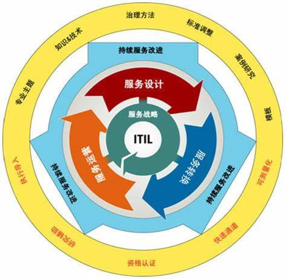
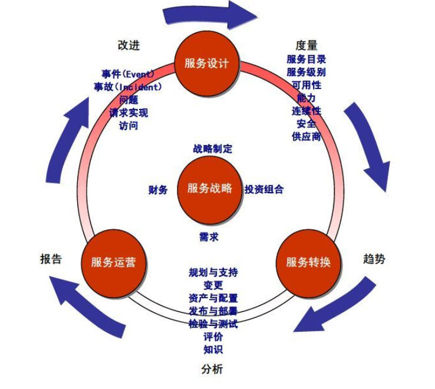
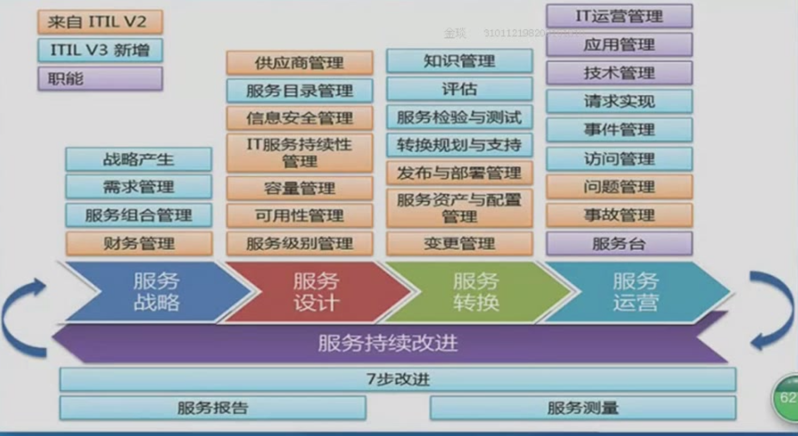

## Q:选CMMI、ASPICE、ITIL、COBIT5或其他任一IT行业标准，围绕1-2张结构或原理图，解释它运用系统化思维决解行业问题方法

### A: ITIL
#### 简介：信息技术基础架构库（Information Technology Infrastructure Library，ITIL）
 * 全球公认的信息技术（IT）服务管理的最佳实践。
 * 英国中央计算机与电信局（简称CCTA）创建，旨在满足将信息技术应用于商业领域的发展需求。
  
####  主要版本：ITIL v3
#### 服务生命框架：

ITIL v3的核心架构是基于服务生命周期的，服务生命周期框架如下图所示。可以看出：
* 服务战略是生命周期运转的轴心 
  将组织在设计、开发和实施服务管理从组织能力和战略资产两个战略角度来提供指导。该模块提出了服务管理实践过程中整个ITIL服务生命周期的政策、指南和流程。
* 服务设计，服务转换和服务运营是实施阶段 
  <b>服务设计</b>描述了对服务及服务管理流程设计和开发的指导。它包括了将战略目标转变成服务投资组合和服务资产的原则和方法；<b>服务转换</b>将新的或变更的服务转换到运营过程中有关能力的开发和改进的指导；<b>服务运营</b>对如何达到服务支持和交付的效果和效率，以确保客户与服务供应商的价值提供了指导。
* 服务改进 
  它结合了质量管理、变更管理和能力改进方面的原则、实践和方法,对服务的定位和基于战略目标对有关的进程和项目的优化改进。

ITIL的核心思想就是通过科学的管理流程，将组织成员、组织知识、基础设施等各种资源科学地组织起来，发挥其最大效益，让IT服务的质量可监控、可评价、可改进。 
整个流程以服务战略为核心，进行服务设计->服务转换->服务运营->服务设计的循环，中间穿插着不断地进行服务的持续改进，达到最后的需求标准。
总的来说，就是首先根据客户服务需求，制定相应的需求，财务，服务组合管理等大致的战略准备。根据战略需求，进行服务设计，设计新的或变更的服务导入到生产环境中，确保设计的各方面都得到全盘考虑，使服务设计的所有活动和流程是整个IT提供端到端的，与业务相关的职能和质量。设定客户在使用新的或变更服务时的期望；服务设计核心在于技术，服务运营考虑的主要是产品之后的运营问题。服务转换作为万金油，利用知识管理，评估，服务检验与测试等方法，将服务技术在实践中的问题以及变更的服务，转换到运营中，服务运营根据一系列分析，指定相应的策略方案，然后进行相应的服务设计。如此循环，做到了产品的不断更新以及漏洞的维护。

