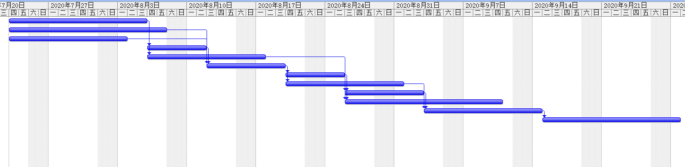

### 题目

#### 6.
* a. 双代号网络图如下： 
  
* b.根据a中双代号图，找出所有路径如下 
  路径1:A-B-E-H-K    长度：2+2+2+2+2 = 10 
  路径2:A-B-E-I-J-K  长度：2+2+2+5+1+2 = 14 
  路径3:A-C-F-H-K    长度: 2+3+3+2+2 = 12  
  路径4:A-C-F-I-J-K  长度: 2+3+3+5+1+2 = 16 
  路径5:A-D-G-J-K    长度: 2+4+6+1+2 = 15 

* c.关键路径为项目是时间最长的那条，为A-C-F-I-J-K 。长度为16
* d.最短时间为关键路径所花的时间，为16工期。

任务进度表

网络图

关键路径： 
A-D-F-G-I-K-L

每项活动的浮动时间

甘特图

