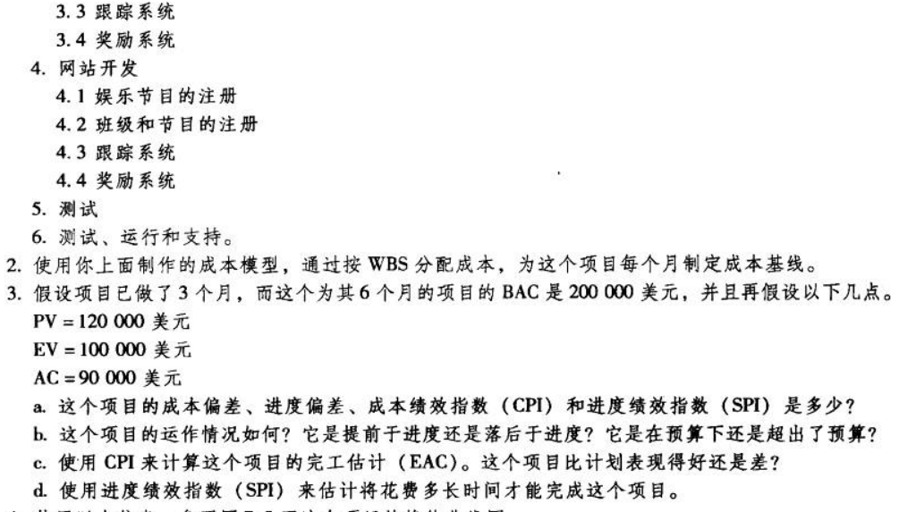
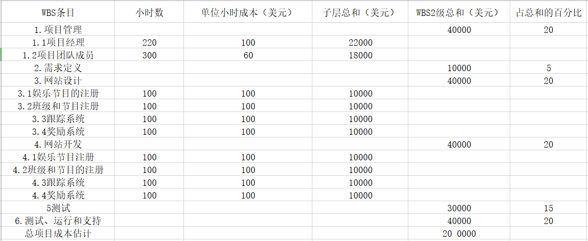
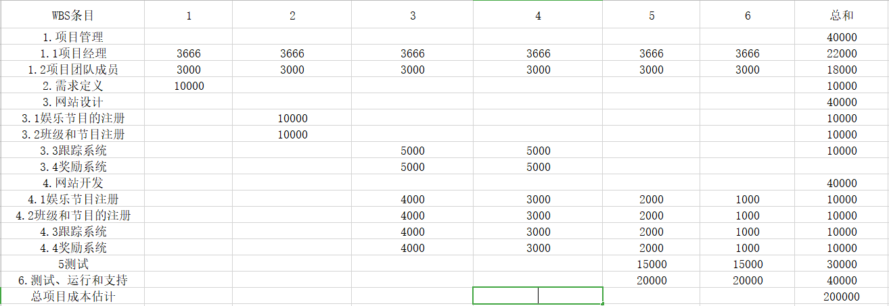

### 题目

### 1.WBS如下

### 2.

### 3.
* a. 成本偏差：CV = EV - AC = 100 000 - 90 000   =  10 000 
    进度偏差：SV = EV - PV = 100 000 - 120 000 = -20 000 
    成绩绩效指数： CPI = EV / AC = 100 000 / 90 000 = 111.11% 
    进度绩效指数：SPI = EV / PV = 100 000 / 12 000 = 83.33% 

* b. 根据SV为负数得知，项目落后与进度；根据CPI大于1，项目成本低于预算。
* c. 完工估计：
EAC = BAC / CPI = 200 000 / 1.1111 = 180 002 < BAC
可以知道项目比计划表现得好。
* d.总时间6个月，
6 / SPI = 7.2
总共需要7.2月来完成，现在已经进行了3个月，还需要4.2个月
