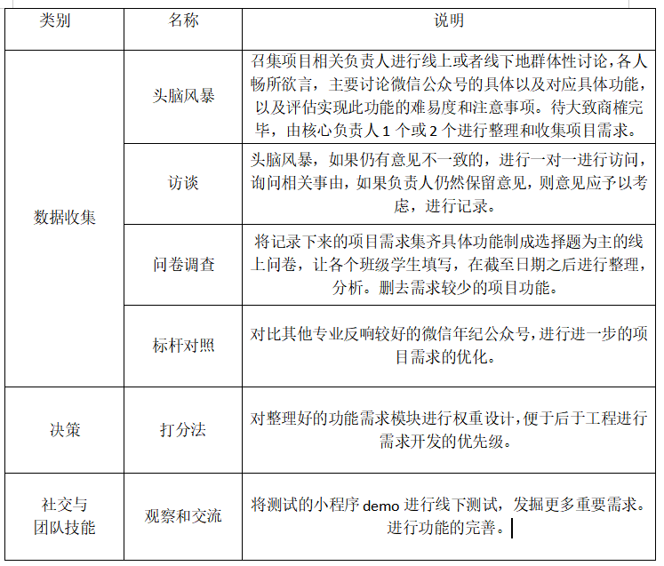
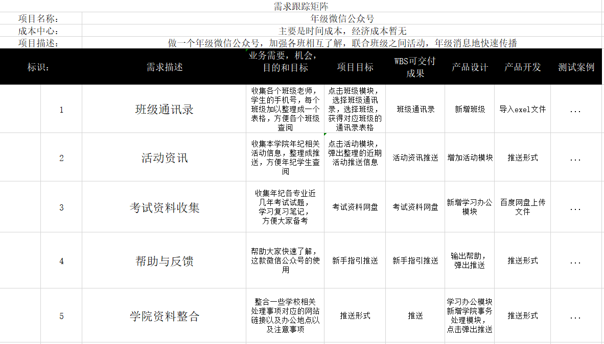

## 个人作业
1. 你联合同学做一个年级微信公众号加强各班相互了解、联合活动
等。请写一份两页的报告，描述收集需求的方法，并附上收集的
需求跟踪矩阵（不少于五个需求）；
3. 使用思维导图，为作业1或2构建WBS ，并使用项目管理工具制作
WBS或根特图。并按要求检查工作包的可管理性，分解完整性。
例如：检查测试、培训等

#### 范围管理
做一个年级微信公众号，加强各班相互了解，联合班级之间活动，年级消息地快速传播

#### 收集需求

#### 需求跟踪矩阵

