## 概述
对于21世纪信息网络的快速发展的时代，学生的日常校园活动很多都需要借助网络的力量查询相关校园信息，中山大学app，提供了一个良好的信息平台，几乎全方面地涵盖了个人想了解的信息，让中大学子快速地适应大学生活。
### 模块功能分析
主要有用模块如下：校园学习，校园导航，校园生活，校园新闻，以及学生交流平台。
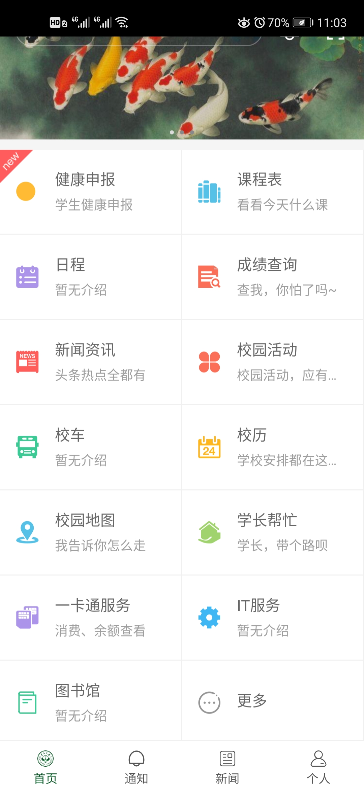

* 校园学习         
  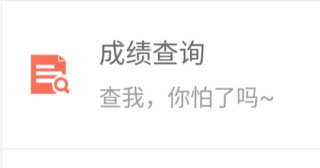   
  点击成绩查询，可以查询到过去相关课程的相关成绩信息，包括任课老师，学分，教学班人数和课程成绩。课程成绩分为平时成绩和期末考试成绩权重与分数。为了区分是否及格，分数用绿色表示及格，红色代表需要重修或者补考。除此之外，可以了解到课程排名以及年纪排名，基本上想了解的成绩信息都涵盖了。唯一不足的就是没有一个学期所有成绩的平均绩点，需要单独去教务系统上查询，不太方便。 
 

 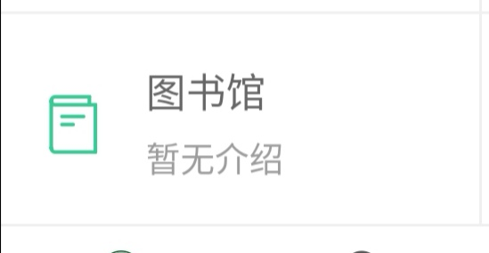  

 点击图书馆，可以查询到自己借书还书以及图书超期情况。比较简单，个人建议增加一个链接，学生可以点击链接跳转到中大图书馆的网页，进行图书查询以及相关图书事项，方便中大学子。

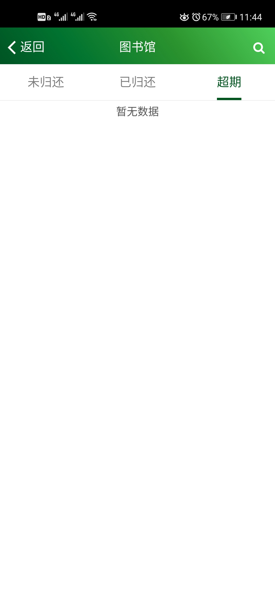
 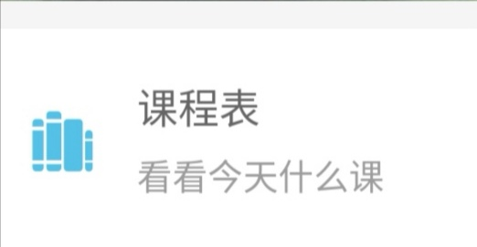  

点击课程表，查询这一周的课程，点击相关课程，可以看到课程详细信息，简洁明了。例如： 

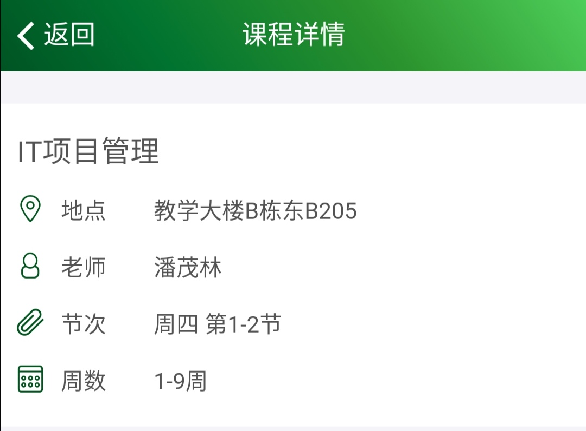  

* 校园导航        
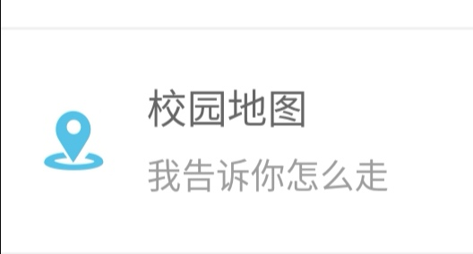   

点击校园地图，查询查询到各大校区地图和周边信息。 

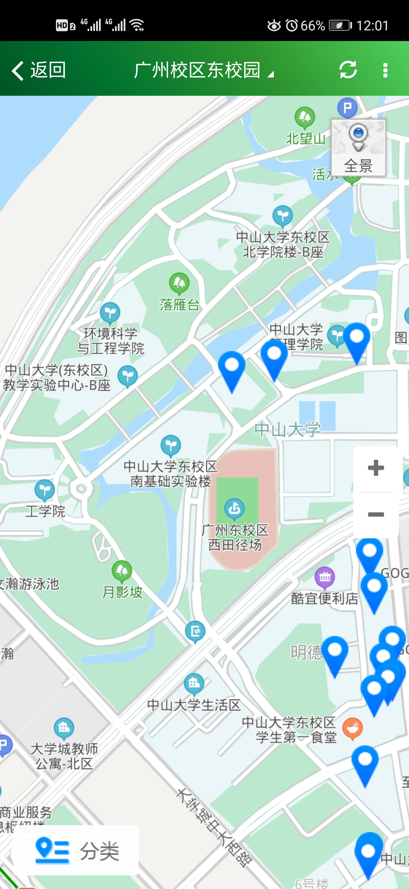   

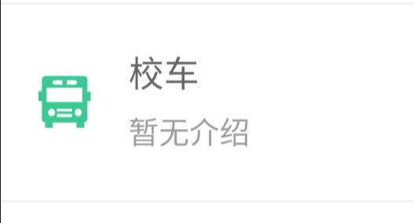   

点击校车，查询各大校园往返的班车信息。 

* 校园生活   
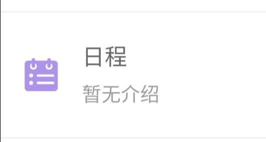

日程，简单来说，就是日期和备忘录的结合。点击进入可以看到今日信息与相关日程。点击特定日期增加日程活动。比较人性化地设计是增加了提醒功能，以免学生遗忘待办事项。   

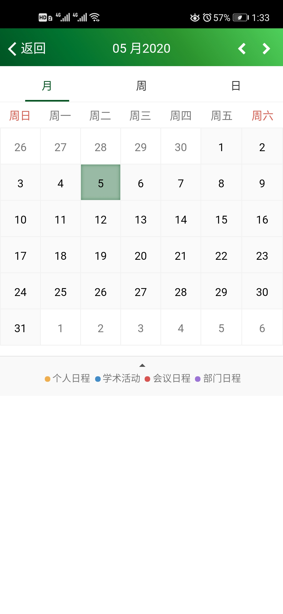  
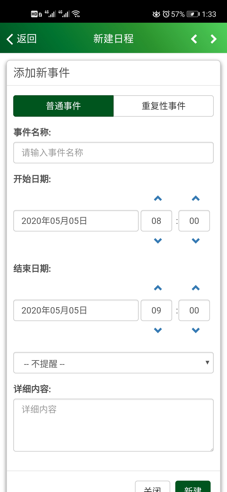  
 

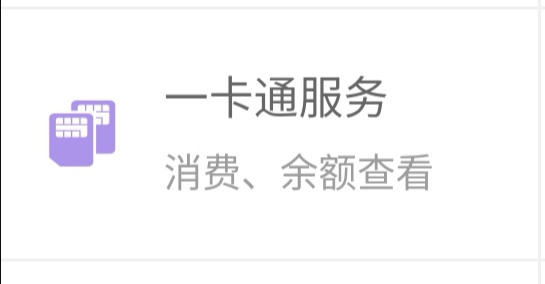   

一卡通服务，查看余额以及交易明细(一方面查看近期学生卡使用情况，另一方面查看学生卡弄丢之后有无使用)，还可以进行挂失解锁申请。

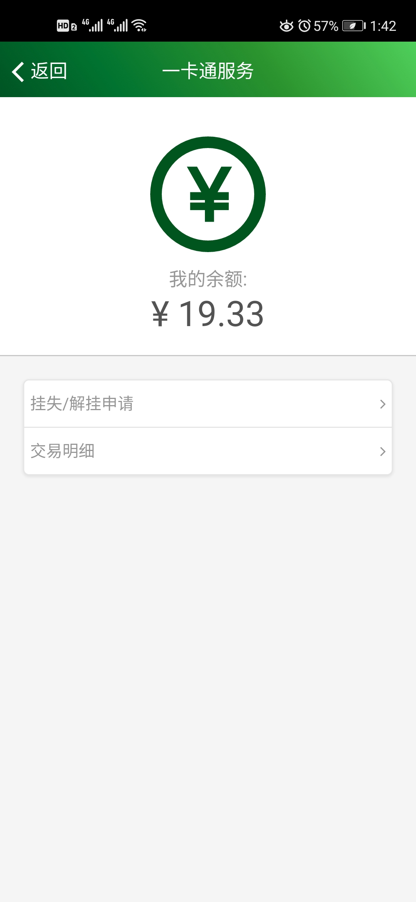    

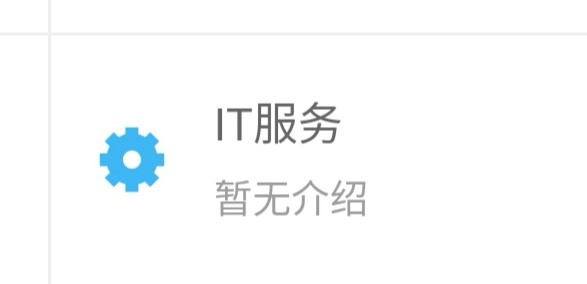   

IT服务，略(不太清楚)

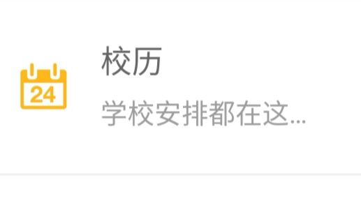   

校历，查看学校对应日期的相关安排。(大部分学生应该关注地是放假的相关日期)
* 校园新闻        
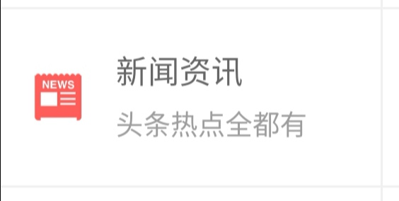   

新闻咨讯，方便学生了解最新学校以及国家大事，为国家和中大自豪！(个人建议能在每篇报道下面增加一个评论区，让更多学生能够畅所欲言，互相交流心得，表达自己的看法，加深自己的理解)

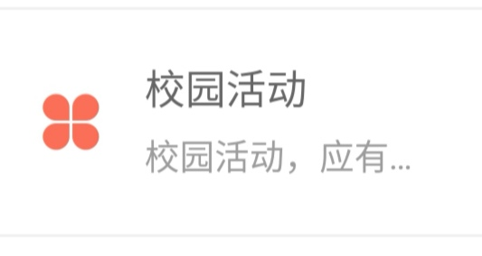   

校园活动，这个模块太过宽泛，因为校园活动有很多方面，比如学校组织的活动，学院组织，团委学生会组织以及社团组织的活动等，因此学校在这个模块用处基本空白，因为信息搜集比较麻烦，而且大部分学生都是根据特定公众号推送来获取最新活动信息。

* 学生交流平台     
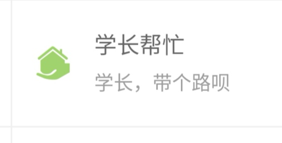    

学长帮忙，简单来说，就是一个生活问题咨询平台。有一定的作用，但是，也有许多信息没有及时地回答，问题没有很好地解决。

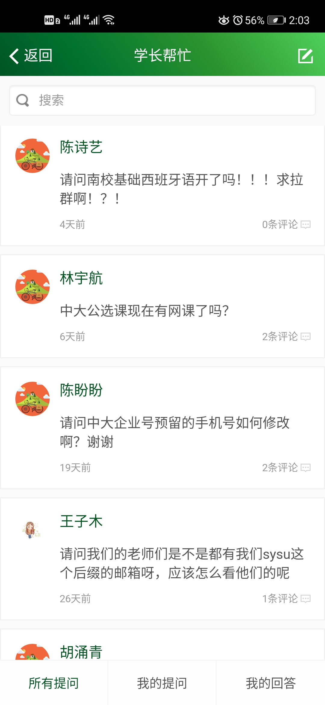