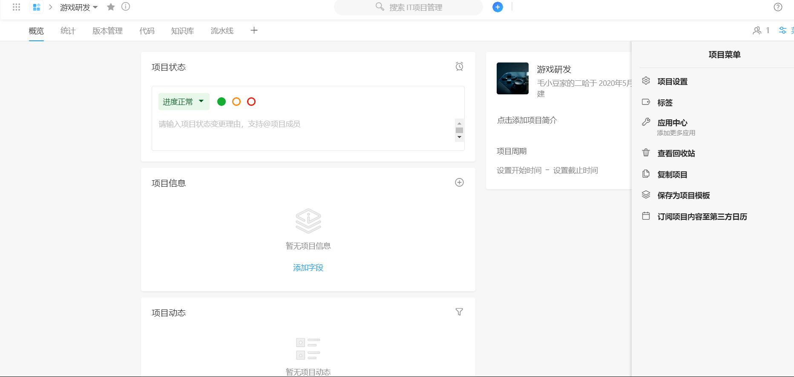

# 竞争产品分析 --阿里云云效

## 产品特色
####  先进性理念
沉淀精益项目管理、敏捷项目研发、流式实时交付、分层自动化等项目管理及研发理念，并将理念通过产品落地实践。
#### 一站式服务
功能覆盖产品研发全生命周期，在“需求-开发-测试-发布-运维-运营”各阶段都有高效工具支持效率提升，并于中间件、容器服务等产品无缝结合，联合打造一站式DevOps服务平台。
#### 安全性保障
依托阿里云强大的安全、存储和稳定性技术保障，实现稳定的分布式代码托管服务，多中心、去存储、强依赖的运维监视及全面的自动化质量保证。
#### 智能化反馈
研发全流程数据沉淀透出，助力组织团队诊断效能瓶颈，实现柔性化研发技术管理。通过自动化数据搜集并进行智能化分析，自动识别发布过程中出现的异常并及时采取合理的措施，避免线上故障的产生。

## 业务支持
在功能上，云效提供项目管理、应用管理、代码托管、自动化测试、持续交付、运营反馈6大功能服务。
#### 项目
    一站式项目 
    管理以项目为维度，管理需求、任务、缺陷、迭代、里程碑、风险和文档。大型项目管理支持父子项目以分级管理战略专题项目，支持项目集合以联合管理双十一等大型协作项目。快速迭代项目管理支持Scrum、看板等多种敏捷实践。
#### 应用
    应用全生命周期管理以应用为单位，申请、创建和配置软件运行所需资源、环境和中间件服务，提供变更、发布、监控和运维等应用全生命周期管理服务。多种部署运行方式支持Docker等多种部署运行方式
#### 交付
    持续交付流多人协作开发集成、多种编程语言构建打包和分布式集群部署发布等服务。质量与安全保障轻松搭建从代码提交、集成、构建到测试环境、预发环境、线上环境部署发布验证的持续交付流水线，质量和安全层层把关。
#### 运营
    用户反馈跟踪用户反馈秒级必答，产品知识智能回复。产品动态监测问卷调查和舆情监测，把握产品动态。数据驱动优化分析研发和运营数据，数据驱动效能提升和产品优化创新。

## 工具
   

